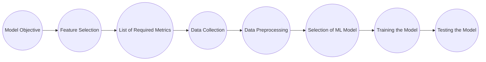
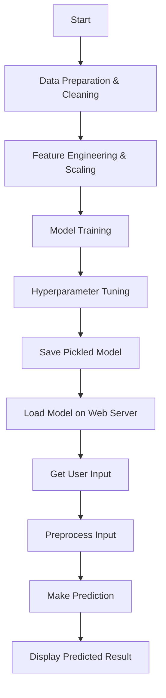

# High Level Design (HLD)
## Erasmus Mundus Scholarship Possibilities Prediction

**Document Version Control**
| Date Issued | Version | Description |
| :--- | :--- | :--- |
| **05th August 2026** | 1.0 | First Version of Complete HLD |

---

## Abstract
Scholarships open doors for students globally, but the application process for prestigious programs like the Erasmus Mundus Joint Master Degree (EMJMD) is highly competitive and often opaque. Applicants spend months preparing materials without knowing their realistic chances of success based on their academic profiles.

Here, we will be considering one use case: predicting the likelihood of a student being awarded the Erasmus Mundus scholarship. We will collect different data samples from past applicants (both successful and unsuccessful), and we will use those data samples to train a machine learning classification model. Once the model is ready, we will deploy it as a web application which will take applicant profiles as input and classify them into categories (e.g., likely to be Awarded vs. Denied). This will help prospective students gauge their chances and identify areas of improvement before applying.

---

## 1. Introduction

### 1.1 Why this High-Level Design Document?
The purpose of this High-Level Design (HLD) document is to add the necessary detail to the current project description to represent a suitable model for coding. This document is also intended to help detect contradictions before coding and can be used as a reference manual for how the modules interact at a high level.

The HLD will:
* Present all of the design aspects and define them in detail
* Describe how the user interface is implemented
* Describe the hardware and software interfaces
* Describe the performance requirements
* Include design features and the architecture of the project
* List and describe the non-functional attributes like Security, Reliability, Maintainability, Portability, Reusability, Application compatibility, Resource utilization, and Serviceability.

### 1.2 Scholarship Background
As the global demand for highly educated professionals increases, international scholarships like Erasmus Mundus have become intensely competitive. Going forward, the availability of clear metrics for what makes a successful applicant is crucial. To meet these requirements, we need a data-driven prediction model.

The idea of a scholarship prediction tool was developed after analyzing historical applicant data. It was thought that Machine Learning technology could be used to identify hidden patterns in academic profiles (like the extreme importance of Research Experience). Thus, the Scholarship Prediction Model was introduced to provide clarity to future applicants.

### 1.3 Problem Statement
To manage the anxiety and uncertainty of the application process, predictive models are used in educational consulting to identify strong applicant profiles among many others. This can lead to productivity gains with minimization of wasted effort, and consistency of application quality.

Our mission is to build a smart system that is designed to detect, identify, & make critical predictions around an applicant's profile with the help of Machine Learning Classification Techniques.

#### 1.3.1 Use Cases
**Identify the likelihood of an applicant receiving the scholarship and notify the user with a proper percentage or classification.**

We use Random Forest and K-Nearest Neighbors Classification techniques to identify the success probability by providing data analysis in real-time. This can be used by students for profile evaluation by pre-processing their academic metrics (CGPA, GRE, Internships).

#### 1.3.2 Application Flow for Use Case

*Fig. 01: Application Flow for Scholarship Prediction Use Case*

### 1.4 Definitions
| Term | Description |
| :--- | :--- |
| **EMJMD** | Erasmus Mundus Joint Master Degree |
| **EDA** | Exploratory Data Analysis |
| **IDE** | Integrated Development Environment (e.g., VS Code) |
| **SMOTE** | Synthetic Minority Over-sampling Technique (for handling imbalanced data) |

---

## 2. General Description

### 2.1 Product Perspective
The Scholarship Prediction system is a machine learning-based classification model which will detect the probability of a successful application and intimate to users about their chances. Also, this will forecast which specific features (like University Rating or Research) they need to improve to increase their yield.

### 2.2 Technical Requirements
Different user bases require different ways of access. This document addresses the requirements for a web-based portal.
* The application should be able to run on any modern web browser without causing high CPU load on the client side.
* The system should include data input forms for numerical (CGPA, GRE) and categorical (Internship, Research) data.
* The backend should be equipped with proper computing power to process the data through the pickled Machine Learning model.

### 2.3 Data Requirements
The dataset used for this project consists of historical graduate application records. We are considering features such as `GRE_Score`, `CGPA`, `University_Rating`, `Internship`, `Research`, and our engineered feature `Years_Since_Graduation`.

#### 2.3.1 The Graduate Dataset
The symptoms of a strong profile consist of numerous metrics. Our EDA proved that certain features are "Gatekeepers" (Internship, Research) while others are "Useless Noise" (Country, Target Program) which were dropped to prevent overfitting.

### 2.4 Tools used
Python programming language and frameworks such as Numpy, Pandas, Scikit-learn, and Matplotlib are used to build the whole model.
* **VS Code / Jupyter** is used as IDE.
* **Matplotlib & Seaborn** are used for the visualization of the plots.
* **Scikit-learn** is used for ColumnTransformers, Scaling, and Model Training.
* **Streamlit / Flask** is intended for the web dashboard deployment.

### 2.5 Constraints
The system must be user-friendly, as automated as possible and users should not be required to know any of the machine learning workings (like Yeo-Johnson Power Transformations or OneHotEncoding).

### 2.6 Assumptions
The main objective of the project is to predict the scholarship outcome for new applicant data that comes through the web interface. A Random Forest/KNN based classification model is used. It is also assumed that all aspects of this project can work together in the way the designer is expecting. 

### 2.7 Objective
The main objective of the project is to detect scholarship probability accurately.
* To design such a system that can predict outcomes accurately based on historical trends.
* To help applicants detect weaknesses in their profile before applying.

---

## 3. Design Details

### 3.1 Process Flow
For identifying outcomes, we will use a machine learning-based model. Below is the process flow diagram for identifying the predictions.

*Fig. 02: Proposed Methodology and Deployment Process*

### 3.2 Event Log
The system should log every event so that the administrator will know what process is running internally (e.g., when a user makes a prediction request, or if an input value is out of bounds).

### 3.3 Error Handling
Should errors be encountered (e.g., user inputs a CGPA of 5.0 on a 4.0 scale), an explanation will be displayed as to what went wrong.

### 3.4 Performance
The solution is used for predicting the outcome whenever an applicant inputs their data, it should be as accurate as possible (targeting >90% accuracy). So that it will not mislead the students. Also, model retraining with new application cycles is very important to improve performance.

### 3.5 Reusability
The preprocessing pipeline (`ColumnTransformer`) and the components used should have the ability to be reused with new data via the pickled `preprocessor.pkl` file.

### 3.6 Application Compatibility
The different components for this project will be using Python as an interface between them.

### 3.7 Resource Utilization
When model inference is performed, it is lightweight and will utilize minimal processing power until that function is finished.

### 3.8 Deployment
Deployment will be handled via cloud services (e.g., AWS, Heroku, or Streamlit Cloud) to ensure 24/7 uptime for prospective students worldwide.

---

## 4. Dashboards

Dashboards will be implemented to display and indicate certain KPIs and relevant indicators for the scholarship applicant.

### 4.1 KPIs (Key Performance Indicators)
Key indicators displaying a summary of the applicant profile as compared to a historical successful profile:
1. Probability percentage of being awarded the scholarship.
2. Comparison of the user's CGPA and GRE against the median successful applicant.
3. Flagging missing "Gatekeeper" requirements (e.g., missing Research experience).

---

## 5. Conclusion
The Designed Machine Learning system will analyze the applicant data based on the dataset trained using our algorithm. We can identify the weak points in an applicant's profile in the early stages and transmit the information so that students can take necessary action (like securing an internship) to increase their yield of success.

---

## 6. References
1. Documentation of Scikit-Learn: https://scikit-learn.org/
2. Pandas API Reference: https://pandas.pydata.org/docs/
3. Exploratory Data Analysis & Feature Engineering logic derived from local Jupyter Notebooks (`1_EDA_Scholarship.ipynb`, `2_Feature_Engineering_and_Model_Training.ipynb`).
