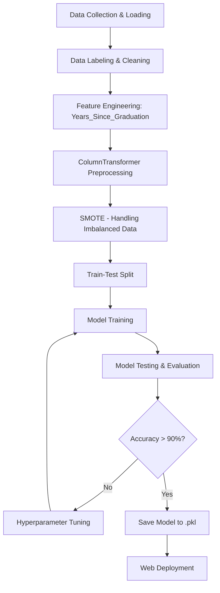
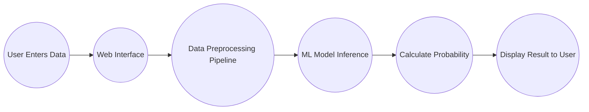

# Low-Level Design (LLD)
## Erasmus Mundus Scholarship Prediction Solution

**Document Version Control**
| Date Issued | Version | Description |
| :--- | :--- | :--- |
| **05th August 2026** | 1.0 | First Draft of Complete LLD |

---

## 1. Introduction

### 1.1 Why this Low-Level Design Document?
The purpose of this document is to present a detailed description of the Erasmus Mundus Scholarship Prediction Solution. It will explain the detailed features, interfaces of the system, its capabilities, and how the machine learning pipeline is structured. This document is intended for the developers of the system and will be proposed to the higher management for its technical approval.

The main objective of the project is to detect the probability of a student being awarded an Erasmus Mundus Scholarship based on academic metrics, and notify the student with accurate probability scores. This is achieved using Classification Techniques using Scikit-Learn.

### 1.2 Scope
This system will be designed to predict scholarship outcomes at the earliest stage (pre-application) for better profile management. It will act as a profiling tool so that prospective students can understand their weaknesses.

### 1.3 Constraints
The accuracy of the model is highly dependent on the historical data. If the Erasmus Mundus committee suddenly changes their rubric (e.g., stops valuing Research Experience), the model's accuracy will temporarily degrade until it is retrained on new data.

### 1.4 Risks
*   Imbalanced Data: The initial dataset is highly imbalanced (many more rejected applicants than accepted).
*   User Input Error: Users may input their CGPA on a different scale (e.g., 10.0 scale) while the model expects a 4.0 scale.

### 1.5 Out of Scope
*   Automated Application Submission: The system will not apply for the scholarship on behalf of the user.
*   Document Verification: The system assumes the user inputs truthful data; it does not verify transcripts or LORs.

---

## 2. Technical Specifications

### 2.1 Dataset Overview
| Feature Name | Finalized | Source |
| :--- | :--- | :--- |
| `GRE_Score` | Yes | Graduate.csv |
| `CGPA` | Yes | Graduate.csv |
| `University_Rating` | Yes | Graduate.csv |
| `Internship` | Yes | Graduate.csv |
| `Research` | Yes | Graduate.csv |
| `Years_Since_Graduation` | Yes (Engineered) | Derived from `Graduation_Year` |

The dataset consists of historical records of students who applied for graduate programs and scholarships. The target variable is `Scholarship_Awarded` (Yes/No).

### 2.2 Predicting Outcome
*   The student will enter their academic metrics into a web form.
*   The backend will capture this data, run it through a Pre-Trained Machine Learning Model (Pickle file).
*   If the model detects a low probability, the system will notify the student with precautions and suggestions (e.g., "Consider acquiring Research Experience").

---

## 3. Technology Stack

| Component | Technology |
| :--- | :--- |
| **Programming Language** | Python 3.x |
| **Machine Learning Model** | Scikit-Learn (Random Forest, KNN) |
| **Data Manipulation** | Pandas, Numpy |
| **Web Dashboard** | Streamlit / Flask |
| **Deployment** | AWS / Heroku |

---

## 4. Proposed Solution

Our mission is to build a smart machine that is designed to make critical decisions around an academic profile. It is essential to identify weaknesses before a student wastes months of effort applying for an out-of-reach scholarship.

**Use Case:**
*   Identify the scholarship probability and notify the applicant.
*   Provide a breakdown of what features heavily influenced the decision (Feature Importance).

---

## 5. Model Training / Validation Workflow

*Fig. 01: Model Workflow*

---

## 6. User I/O Workflow

*Fig. 02: User I/O Workflow*

---

## 7. Machine Learning Pipeline Details

The Scikit-Learn framework is used for creating a robust machine learning network that solves classification problems.

### 7.1 Preprocessing (ColumnTransformer)
Instead of manually processing data, a `ColumnTransformer` is used to build a unified preprocessing pipeline:
*   **OneHotEncoder:** Applied to Categorical features (`Research`, `Internship`).
*   **PowerTransformer (Yeo-Johnson):** Applied to skewed numerical features (`Work_Experience_Months`, `Years_Since_Graduation`).
*   **StandardScaler:** Applied to normally distributed numerical features (`CGPA`, `GRE_Score`, etc.).

### 7.2 SMOTE (Synthetic Minority Over-sampling Technique)
To handle the imbalanced nature of scholarship datasets (where 'Denied' cases heavily outnumber 'Awarded' cases), `SMOTETomek` is used during the training phase to synthetically generate minority class samples, preventing the model from becoming biased towards rejection.

---

## 8. Hyperparameter Tuning

We utilize ensemble models and distance-based models for classification. To achieve peak accuracy, **RandomizedSearchCV** is utilized.

**Algorithms Tested:**
1.  **Random Forest Classifier:** A meta estimator that fits a number of decision tree classifiers on various sub-samples of the dataset.
2.  **K-Nearest Neighbors (KNN):** A non-parametric supervised learning method.

*Weights & Biases* and cross-validation metrics (Accuracy, F1-Score, ROC-AUC) are directly integrated into the evaluation loops to determine the best estimator.

---

## 9. Test Cases

| Test Case | Steps to perform test case | Module | Pass/Fail |
| :--- | :--- | :--- | :--- |
| **TC_01** | Input perfectly average metrics (CGPA 3.0, No Research). Verify probability is low. | Prediction Inference | Pending |
| **TC_02** | Input exceptional metrics (CGPA 4.0, Internship Yes, Research Yes). Verify probability > 85%. | Prediction Inference | Pending |
| **TC_03** | Submit empty form. Verify appropriate error message is thrown. | Web Interface | Pending |

---

## 10. Key Performance Indicators (KPI)
*   Comparison of accuracy of model prediction vs actual historical outcomes.
*   F1-Score and ROC-AUC of the trained Random Forest model.
*   Time taken for the web server to return a prediction result to the user.
*   Number of profiles processed per day via the web portal.
